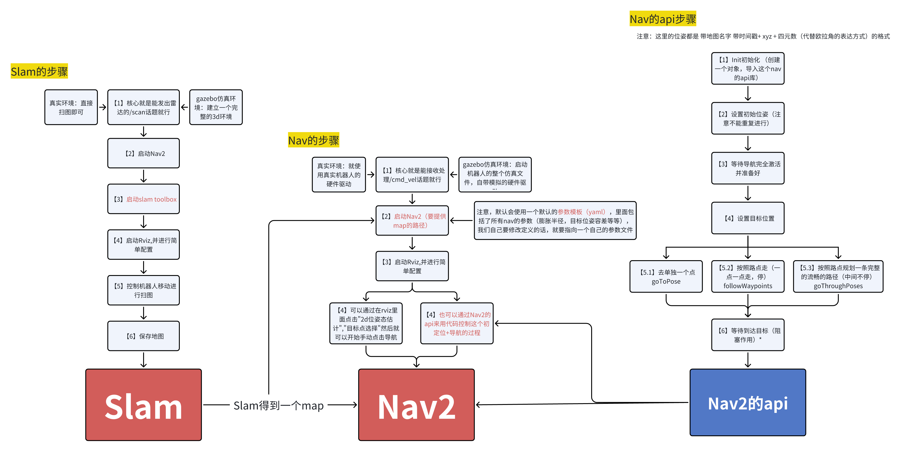

### 1，定义

nav2其实也是一个功能包，负责导航和避障的功能

我们这章同时也要学习slam建图的内容


gazebo完整3d环境 -> slam toolbox扫图 -> nav导航

（仿真环境才需要gazebo，如果是真实世界，不需要gazebo的完整环境）
### 2，安装nav2和turtlebot3

这个turtlebot3是一个常用的机器人模型（还有传感器配置，gazebo配置等等），我们安装了这个包，就可以着重于学习nav2的部分。

教程里面安装是通过一个命令一下子安装3个包：
```
sudo apt install ros-humble-navigation2 ros-humble-nav2-bringup ros-humble-turtlebot3*
```

但是我这里的环境版本配置有点不一样，所以具体的安装步骤，参见
/home/hzh/ros2_ws/src/Nav2_TurtleBot3_Installation_Guide.md


### 3，配置turtlebot3
turtlebot3有3个模型：
	 - burger - 最小，最便宜
	  - waffle - 中等，带摄像头
	  - waffle_pi - 完整版，带摄像头和更多传感器

- 我们这里用的是waffle中等模型，然后所有命令必须指定一个模型，所以我们把模型写入环境变量

```
export TURTLEBOT3_MODEL=waffle
```


- 在gazebo中启动turtlebot3

```
ros2 launch turtlebot3_gazebo turtlebot3_world.launch.py 
```

注意的是：新版本gazebo的雷达扫描区域不会默认显示，所以需要，右上角搜索“*Visualize Lidar*”，然后会出现一个窗口，点这个旋转箭头几下就行了，然后底下type里面可以选择如何显示的扫描区域


然后可以启动一个控制机器人移动的节点来简单移动一下机器人
```
ros2 run turtlebot3_teleop teleop_keyboard 
```


### 4,初步SLAM建图

注意要安装一下Cartographer 相关包
```
sudo apt install -y ros-humble-cartographer ros-humble-cartographer-ros
```

他的主要功能是定位和建图

【1】*启动 Cartographer SLAM*
```
ros2 launch turtlebot3_cartographer cartographer.launch.py use_sim_time:=True
```


【2】*之后配合上我们刚刚做的gazebo和teleop，控制机器人扫描完完整的图（差不多就行，不用太精确）*

```
ros2 run turtlebot3_teleop teleop_keyboard 
```


【3】*最后记得要保存一下这个地图。我们直接在主目录下创建一个文件夹maps，然后保存在里面*
```
mkdir maps
```

```
ros2 run nav2_map_server map_saver_cli -f maps/my_map
```
注意这个 -f 后面跟的是你要保存的路径，/my_map是你给它起的名字，不需要写拓展名


这个pgm就是地图的图片，这个yaml里面包含着地图的一些信息：

这个第三行是最重要的*resolution：0.05，,它代表着分辨率，也就是一个像素点是多少m，这里是一个像素点是0.05m，也就是5cm。换句话说就是这个地图扫出来的精度是5cm*

origin是地图左下角的点相对于机器人初始点的坐标

nagate是反转（0就是正常，如果是1的话，就是白的变成黑的，黑的变成白的）

occupied_thresh 和 free_thresh 代表着一个像素点多少比例趋近于黑色，那么它会被判断为 黑色（障碍物） or 白色（自由区域）
这里0.65说明，只要一个点65%趋近黑色（大于等于），那么他就会认为是黑色点（障碍物）
0.25代表着，只要一个点25%趋近黑色（小于等于），那么他就会认为是白色点（自由区域）


还有一种查看地图信息的方式是


这个代表着x轴上有多少个像素点，y轴上有多少个像素点
结合我们之前的一个像素点是5cm，也就可以算出整个地图的大小
124 。 0.05 = 6.2 也就是整个地图长6.2m
115 。 0.05 = 5.8 也就是整个地图宽5.8m


### 5,初步使用使用nav

【1】首先还是启动gazebo
```
ros2 launch turtlebot3_gazebo turtlebot3_world.launch.py 
```

【2】然后启动nav的包
```
ros2 launch turtlebot3_navigation2 navigation2.launch.py use_sim_time:=True map:=maps/my_map.yaml 
```
注意这里提供了map的路径（也就是从命令行的路径->地图yaml文件的路径）


【3】点击2d位姿估计，给机器人设定一个大概的目前的位置在哪里，不需要太精确它会自己匹配


看到机器人附近这个扫描的雷达线跟地图的线匹配，就说明位置是对的


【4】点nav2 goal 就可以进行导航


【5】使用waypoints，导航多个路径点


使用第一个选项through poses的话，就是不会每个点都停下来，它会连贯地通过每个点


【6】同时，nav2有动态避障的功能

这里我们先选定一个点，然后点击暂停，再放置一个障碍物在路径中间，再点击继续

会发现它扫描到了障碍物，然后选择换了一条路走


### 6,global planner（重要）
全局规划是直接通过地图来进行路径规划的，一般用的是迪杰斯特拉 or A星算法，会规划出一条淡红色的路径，根据的是一个叫costmap的东西


这些有颜色的地方就是costmap
淡蓝色代表离障碍物的安全距离（规划的时候会尽量避免离障碍物太近）
靠近障碍物的地方，颜色越红，代表成本越高
越远离，颜色越蓝，代表成本越低
白色代表成本为0的地方

也就是成本：淡蓝色>>红色>蓝色>白色

规划的时候也是根据这个costmap来选取一条成本最低的路径


### 7,local controller（重要）

*其实就是global planner把全局的规划路径（淡红色路径）告诉给local controller，然后local controller根据自身局部的costmap（颜色区分跟全局的costmap一样），以尽量符合全局路径的情况下，来选择一条目前的移动方向（local plan蓝色的路径）并进行控制。*

可以想象成，global planner是gps，它告诉你你到目标点的路径。然后local controller是你自己开着车，虽然是尽可能贴合gps的路径，但是你也要根据你附近的情况，选择一条目前合适的控制方案。（可能抄近路或是其它）

所以local controller的更新频率会比global planner高很多


### 8,一些重要的参数（重要）

提一嘴，在最后15我们是通过一个参数文件来修改这些东西，所以这里只是提前了解看一下大概有哪些参数

在rqt——plugins——configuration——dynamic reconfigure可以看到所有的参数

- 在global costmap里面

【1】*inflation_layer.inflation_radius通货膨胀半径*
也就是xx m之内才会算成本，比如这里我们修改成0.25，因为障碍物安全范围大概是4个像素点也就是0.2m(跟下面的robot_radius有关系)，所以0.25m的成本范围，使得有颜色的像素点也就是有成本的像素点只有一圈，其它都是零成本的白色像素点

这个参数越小，规划的路径就会越贴近障碍物，走的越快，并且寻找路径越容易，但是没有那么安全

【2】*robot_radius机器人的半径*，其实就是它用来计算距离障碍物的安全半径的


【3】*publish_frequency发布频率*


- 在local costmap里面

【1】publish_frequency发布频率


【2】inflation_layer.inflation_radius通货膨胀半径
跟global costmap是一样的


- 在controller_server里面

【1】controller_frequency控制器的频率


【2】*general_goal_checker.xy_goal_tolerance目标点误差的容忍度*
也就是最后导航误差，你可以接受多少的误差


### 9,recovery server恢复行为
当机器人遇到无法找到前往目标点的路径的情况下，它会执行一个恢复行为，也许是后退一点，也许是旋转一点，也许是清理地图。如果执行完恢复行为之后发现可以找到路径了，那么它会继续导航，如果恢复之后还是不行，那就不行，也许会停止


### 10,nav2中的tf坐标

map (地图坐标系)，不会漂移
odom (里程计坐标系)，会累积漂移
base_footprint，机器人底盘在地面的投影

odom：高频、平滑，但长期漂移
map：低频、可能跳变，但长期准确

所以这里nav2融合了两种坐标的优点。


### 11,nav2的构建层次


这里特别解释一下这个BT Navigator Server，bt意思是behavior tree，相当于 塔台主管
他来安排每个人员的任务流程
塔台主管 (BT Navigator)
      │
      ├─ 指挥调度员 A (Planner Server) → "规划一条从 A 到 B 的航线"
      │
      ├─ 飞行员 B (Controller Server) → "按照这条航线飞行"
      │
      ├─ 地勤人员 C (Recovery Server) → "遇到问题了，执行应急处理"


### 12,自建地图
因为我们的流程是，先在gazebo里面创建一个完整的3d环境，然后通过【4】第四步，来扫描扫出一个地图。
所以自建地图的核心就是在gazebo里面创建一个3d环境，其实在[[15，gazebo]]的第6步里面有讲过，我们这个版本的gazebo自定义构建环境功能不如旧版，但是可以通过mesh，直接导入solidworks创建好的环境。所以也能完成类似的功能


### 13,手动ps修改slam的地图
就是当slam扫出来的地图存在问题，比如障碍物不全，然后自由空间不干净之类的情况，就可以使用*ps手动修改图片*，我们这里用的是一个图像修改软件，叫gimp。（yaml文件不用动，都一样的）

【1】安装gimp
```
sudo snap install gimp
```

【2】启动gimp
就输入gimp就行
```
gimp
```

【3】修改图像


### 14,通用的slam方法（重要）

【1】安装通用的slam包，slam toolbox
```
sudo apt install ros-humble-slam-toolbox
```

【2】*启动机器人，确保你的机器人发出了雷达的/scan话题（因为slam toolbox依赖这个话题）*

我们这里用的还是turtlebot。所以启动robot，然后因为我们这里是虚拟仿真，所以需要启动gazebo。如果是现实环境的话，确保你机器人能发出雷达话题就行
```
ros2 launch turtlebot3_gazebo turtlebot3_world.launch.py 
```


【3】*这里需要先启动nav*
```
ros2 launch nav2_bringup navigation_launch.py use_sim_time:=True
```
他就输出一些信息


【4】*启动slam toolbox*

```
ros2 launch slam_toolbox online_async_launch.py use_sim_time:=True
```

这里也只是显示一些信息


【5】*启动rviz*
```
ros2 run rviz2 rviz2
```

- 手动添加tf
	

- 手动添加map
	
	一开始会有一个错误，因为他不知道订阅哪个地图话题。你要手动选择话题/map
	
	

- 手动添加雷达信息（可选）
	
	也是要选择订阅正确的话题/scan
	

- 手动添加机器人模型（可选）
	
	依然是要选择一下正确的话题订阅
	


这样就跟之前的效果一样了

当然手动配置之后可以保存配置文件，之后可以使用配置文件，跳过手动添加的过程


接下来的步骤跟 4,初步slam建图 里面的【2】之后差不多了
【6】*启动一个控制机器人移动的节点进行扫图*

这里我们用的还是turtlebot的teleop_keyboard
```
ros2 run turtlebot3_teleop teleop_keyboard 
```

然后控制机器人移动，扫图


【7】*保存地图*

```
ros2 run nav2_map_server map_saver_cli -f maps/my_world
```
注意这个 -f 后面跟的是你要保存的路径，/my_map是你给它起的名字，不需要写拓展名


### 15,通用的nav方法（重要）

【1】*还是首先启动机器人*
如果是真实环境，就启动真实机器人的硬件驱动
```
ros2 launch turtlebot3_gazebo turtlebot3_world.launch.py 
```

【2】*启动nav*
*注意这里提供了map的路径*（也就是从命令行的路径->地图yaml文件的路径）
```
ros2 launch nav2_bringup bringup_launch.py use_sim_time:=True map:=maps/my_map.yaml
```

这里依旧是只显示一些信息


- *注意！*:
这个nav的bringup会默认使用一个默认的*参数文件*模板（参数有哪些，可以参见本章的8，比如costmap的膨胀半径，机器人的半径等等），但是我们以后在用自己的机器人的时候,需要设计一个适合自己机器人的参数文件！
这个默认的参数文件就是/opt/ros/humble/share/nav2_bringup/params/nav2_params.yaml，可以在它的基础上进行修改！
然后在启动bringup的时候指定我们自定义的参数文件！

```
/opt/ros/humble/share/nav2_bringup/params/nav2_params.yaml
```

也放了一个在我的工作区（修改过的，有备注的）
```
/home/hzh/ros2_ws/src/my_robot_bringup/config/nav2_params_custom.yaml
```


【3】*启动rviz*
```
ros2 run rviz2 rviz2
```


【4】*依旧是一样的添加各种配置的过程*

特别注意的是，map这里，选择完话题之后，他的问题不会消失，你要改一个底下的选项才行


可以看到最上面还是有问题，是因为还没有进行2d位姿估计

进行2d位姿估计


到这里其实差不多了

当然可以再添加两个地图，就是global costmap和loacl costmap（就是map，只是重命名了，并且订阅的话题也不一样）


添加全局规划的路径显示和局部路径的显示


当然也是一样的，可以保存rviz的配置
/home/hzh/ros2_ws/src/my_robot_bringup/rviz/my_nav.rviz


把以上内容整合一下，就可以写成一个启动文件
/home/hzh/ros2_ws/src/my_robot_bringup/launch/my_turtlebot_nav.launch.xml


### 16,nav的api （重要）
其实就是通过代码直接控制nav，不用我们在rviz上面一个个手点


- 【1】其实nav的核心是通过各种topic和action来进行通讯的，然后api也是通过操作对应的topic和action来与nav通讯。所以我们这里先看一下nav的重要topic和action
	这个/initialpose是初始化的位姿的意思。
	
	里面是带有时间戳的pose（rpx用的是四元数），还有一个地图名字信息
	
	这个/navigate_to_pose就是我们导航的那个动作
	


- 【2】安装api（其实应该已经安装过了）
```
sudo apt install ros-humble-nav2-simple-commander
```


- 【3】安装处理计算四元数的库
```
sudo apt install ros-humble-tf-transformations
```

```
sudo apt install python3-transforms3d
```

这里讲一下*欧拉角转四元数的简洁方法*，详见/home/hzh/ros2_ws/src/turtle_nav_demo/turtle_nav_demo/my_nav_demo.py

安装完上述库之后在py代码里面
```
import tf_transformations
```

```
q_x,q_y,q_z,q_w = tf_transformations.quaternion_from_euler(0.0, 0.0, 0.0)
```


- 【4】rviz上简单估算点坐标的方法
地图底色这个方框格，一个就是代表1,比如说我想到前方两格远的点，那就是x = 2.0


或者就是用rviz的publish point功能，它会发布一个话题信息，然后你在终端里面接收它就能看到点位信息了

```
ros2 topic echo /clicked_point
```


- 【5】*写api的py代码*

/home/hzh/ros2_ws/src/turtle_nav_demo/turtle_nav_demo/my_nav_demo.py

*【1】Init初始化 -》【2】设置初始位姿 -》【3】等待导航完全激活并准备好 -》【4】设置目标位置 -》【5.1】去单独一个点 or 【5.2】按照路点走（一点一点走，停） or 【5.3】按照路点规划一条完整的流畅的路径（中间不停）-》【6】等待到达目标（阻塞作用）*

注意就是，这里的位姿都是 带地图名字 带时间戳 xyz + 四元数 的格式

然后这个api的代码其实就是控制nav的代码，

所以之前的nav的整个启动流程启动文件必须提前启动。


### 17,总结

飞书文档：
https://ccnj3kuvti9y.feishu.cn/docx/JElLd8KaWonu1oxOnYycFZzPnBg

