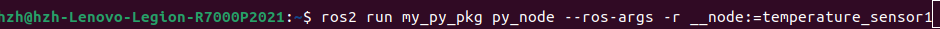

### 重命名节点
在我们运行节点的时候最好不要有一样名字的多个节点
但是例如我们设计好了一个温度传感器的节点，现在有5个温度传感器，因此我们就需要让他们不同名字。

### 简洁构建包
这种构建方法跟前面传统的构建方法比，多了$“--symlink-install”$这句话的意思是：之后$ros2 run$的时候直接运行的就是我们$src$底下我们编辑的那个源程序的代码包，也就是说我们可以一边改一边直接运行，不需要改一下然后每次都要重建再运行。（传统构建方法运行的是install底下的包）

### rqt_graph全局审视节点情况

当然也可以通过这种方式打开rqt_graph

红圈里面introspection-node graph

像这样就是两个节点之间互相有通信（这里用小乌龟显示节点和键盘控制小乌龟节点通信做例子）
